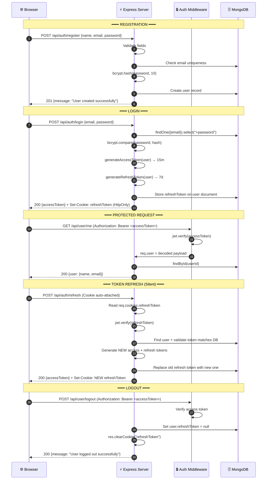
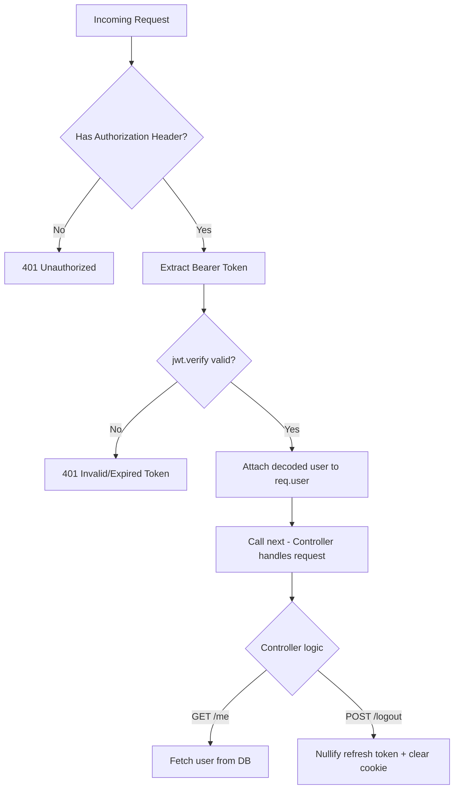

# 🛡️ Auth0 — Production-Grade JWT Authentication Backend


> A secure, cookie-based authentication system implementing **HttpOnly Refresh Token Rotation** — the gold-standard pattern used by companies like Auth0, Firebase, and Okta. Built with Node.js, Express 5, and MongoDB.

---

## 📖 Table of Contents

- [Why This Project?](#-why-this-project)
- [Core Security Model](#-core-security-model)
- [System Architecture](#️-system-architecture)
- [Tech Stack](#️-technical-specification)
- [Project Structure](#-project-structure)
- [Getting Started](#-getting-started)
- [Environment Variables](#-environment-variables)
- [API Reference](#-api-reference)
- [Cookie Configuration](#-cookie-configuration)
- [Security Deep-Dive](#️-security-deep-dive)
- [How Each File Works](#-how-each-file-works)
- [Frontend Client](#-frontend-client)
- [Troubleshooting](#-troubleshooting)
- [License](#-license)

---

## 🎯 Why This Project?

Most tutorial-grade authentication systems store tokens in `localStorage`, which is fundamentally **vulnerable to XSS attacks**. This project takes a different approach:

| Approach                       | XSS Vulnerable? | CSRF Vulnerable? | Production-Ready? |
| :----------------------------- | :-------------: | :--------------: | :---------------: |
| Token in `localStorage`        |     ✅ Yes      |      ❌ No       |        ❌         |
| Token in `Cookie` (no flags)   |     ✅ Yes      |      ✅ Yes      |        ❌         |
| **HttpOnly + SameSite Cookie** |    **❌ No**    |    **❌ No**     |    **✅ Yes**     |

This system uses the third approach — **HttpOnly cookies with `SameSite: strict`** — making the refresh token completely invisible and inaccessible to any JavaScript running in the browser, including malicious scripts injected via XSS.

---

## 🔐 Core Security Model

The system implements a **dual-token architecture** where each token has a distinct role, storage location, and lifecycle:

```
┌──────────────────────────────────────────────────────────┐
│                    TOKEN ARCHITECTURE                     │
├──────────────────────────────────────────────────────────┤
│                                                          │
│  ┌─────────────────┐      ┌──────────────────────────┐  │
│  │  ACCESS TOKEN    │      │  REFRESH TOKEN            │  │
│  │─────────────────│      │──────────────────────────│  │
│  │  Lifetime: 15m   │      │  Lifetime: 7 days         │  │
│  │  Stored: Memory  │      │  Stored: HttpOnly Cookie  │  │
│  │  (localStorage)  │      │  (Browser auto-manages)   │  │
│  │  Sent via:       │      │  Sent via:                │  │
│  │  Authorization   │      │  Cookie header            │  │
│  │  header          │      │  (automatic)              │  │
│  │  Purpose:        │      │  Purpose:                 │  │
│  │  API access      │      │  Silent token renewal     │  │
│  └─────────────────┘      └──────────────────────────┘  │
│                                                          │
│  JS can read: ✅           JS can read: ❌ (HttpOnly)    │
│  XSS can steal: ⚠️         XSS can steal: ❌ IMPOSSIBLE │
└──────────────────────────────────────────────────────────┘
```

**Why split them?**

- The **Access Token** is short-lived (15 minutes). Even if stolen via XSS, the damage window is minimal.
- The **Refresh Token** is long-lived (7 days) but is stored in an `HttpOnly` cookie, meaning **no JavaScript can ever access it** — not `document.cookie`, not `localStorage`, not any script. Only the browser itself attaches it to outgoing requests.

---

## 🏗️ System Architecture

### Full Authentication Lifecycle



### Request Flow Diagram



---

## 🛠️ Technical Specification

| Component          | Technology    | Version | Rationale                                            |
| :----------------- | :------------ | :-----: | :--------------------------------------------------- |
| **Runtime**        | Node.js       |   18+   | Non-blocking I/O, native ES Modules support          |
| **Framework**      | Express       |   5.x   | Minimal footprint, middleware-first architecture     |
| **Database**       | MongoDB       |  Atlas  | Flexible schema, horizontal scaling                  |
| **ORM**            | Mongoose      |   9.x   | Schema validation, middleware hooks, `select: false` |
| **Auth**           | jsonwebtoken  |   9.x   | RFC 7519 compliant token signing/verification        |
| **Encryption**     | bcrypt        |   6.x   | Adaptive hashing with configurable salt rounds       |
| **Cookie Parsing** | cookie-parser | latest  | Parse `Cookie` header into `req.cookies`             |
| **CORS**           | cors          | latest  | `credentials: true` for cross-origin cookie support  |
| **Hot Reload**     | nodemon       |   3.x   | File-watching dev server with auto-restart           |

---

## 📂 Project Structure

```
auth0/
├── server.js                              # Entry point — bootstraps DB, mounts routes, starts server
├── package.json                           # Dependencies, scripts, ES module config
├── .env                                   # Environment secrets (PORT, MONGODB_URI, JWT_SECRET)
│
├── src/
│   ├── config/
│   │   ├── app.js                         # Express instance + middleware (json, cors, cookieParser)
│   │   └── db.js                          # MongoDB connection via Mongoose
│   │
│   ├── middleware/
│   │   └── authMiddleware.js              # JWT verification guard for protected routes
│   │
│   ├── model/
│   │   └── user.model.js                  # User schema (name, email, password, refreshToken)
│   │
│   ├── modules/
│   │   ├── auth/
│   │   │   ├── register.controller.js     # POST /register — create user with hashed password
│   │   │   ├── login.controller.js        # POST /login — authenticate, set cookie, return access token
│   │   │   └── refresh.controller.js      # POST /refresh — rotate tokens, set new cookie
│   │   │
│   │   └── me/
│   │       ├── me.controller.js           # GET /me — return authenticated user's profile
│   │       └── logout.controller.js       # POST /logout — nullify refresh token, clear cookie
│   │
│   ├── routes/
│   │   ├── auth.route.js                  # /api/auth/* route definitions
│   │   └── me.route.js                    # /api/user/* route definitions (protected)
│   │
│   └── utils/
│       └── token.js                       # generateAccessToken() and generateRefreshToken()
│
└── frontend/
    ├── index.html                         # Single-page auth UI
    ├── style.css                          # Glassmorphism dark theme
    └── app.js                             # Client-side API integration
```

---

## 🚦 Getting Started

### Prerequisites

- **Node.js** v18 or higher
- **MongoDB** — local instance or [MongoDB Atlas](https://www.mongodb.com/cloud/atlas) cluster
- **pnpm** (recommended) or npm

### Installation

```bash
# 1. Clone the repository
git clone https://github.com/Dhairya0707/solid-auth-system
cd auth0

# 2. Install dependencies
pnpm install

# 3. Create your .env file (see next section)

# 4. Start development server (with hot-reload)
pnpm dev
```

The server will start on the port defined in your `.env` file (default: `3000`).

---

## 🔧 Environment Variables

Create a `.env` file in the project root:

```env
PORT=3000
MONGODB_URI=mongodb+srv://<username>:<password>@cluster.mongodb.net/auth0
JWT_SECRET=your_256_bit_random_secret_here
```

| Variable      | Description                     | Example                                |
| :------------ | :------------------------------ | :------------------------------------- |
| `PORT`        | Server port                     | `3000`                                 |
| `MONGODB_URI` | MongoDB connection string       | `mongodb+srv://...`                    |
| `JWT_SECRET`  | Secret key for signing all JWTs | `a8f2e9...` (use a long random string) |

> ⚠️ **Never commit `.env` to version control.** The JWT_SECRET is the single point of trust for your entire auth system.

---

## 🔌 API Reference

### Auth Module — `/api/auth`

These endpoints are **public** (no authentication required).

---

#### `POST /api/auth/register`

Creates a new user account with a bcrypt-hashed password.

**Request:**

```json
{
  "name": "Dhairya Darji",
  "email": "dhairya@example.com",
  "password": "securePassword123"
}
```

**Response (201):**

```json
{
  "message": "User created successfully"
}
```

**Error Responses:**
| Status | Condition | Body |
| :---: | :--- | :--- |
| `400` | Missing fields | `{"message": "All fields are required"}` |
| `409` | Email already registered | `{"message": "Email already exists"}` |
| `500` | Server error | `{"message": "Internal server error"}` |

---

#### `POST /api/auth/login`

Authenticates the user. Returns an access token in the JSON body and sets the refresh token as an **HttpOnly cookie**.

**Request:**

```json
{
  "email": "dhairya@example.com",
  "password": "securePassword123"
}
```

**Response (200):**

```json
{
  "accessToken": "eyJhbGciOiJIUzI1NiIs..."
}
```

**Response Headers:**

```
Set-Cookie: refreshToken=eyJhbG...; Path=/; HttpOnly; SameSite=Strict; Max-Age=604800
```

> 📌 Notice: The refresh token is **not** in the JSON body. It is set as an HttpOnly cookie by the server. The browser stores and sends it automatically on subsequent requests.

**Error Responses:**
| Status | Condition | Body |
| :---: | :--- | :--- |
| `400` | Missing email/password | `{"message": "All fields are required"}` |
| `401` | Email not found | `{"message": "User not found"}` |
| `401` | Wrong password | `{"message": "Invalid password"}` |

---

#### `POST /api/auth/refresh`

Rotates the refresh token. Reads the current refresh token from the **cookie** (not request body), validates it against the database, and issues a brand-new token pair.

**Request:**

- No body required — the browser automatically sends the `refreshToken` cookie.
- The request **must** include cookies (use `credentials: 'include'` in fetch).

**Response (200):**

```json
{
  "accessToken": "eyJhbGciOiJIUzI1NiIs..."
}
```

**Response Headers:**

```
Set-Cookie: refreshToken=<NEW_TOKEN>; Path=/; HttpOnly; SameSite=Strict; Max-Age=604800
```

**Error Responses:**
| Status | Condition | Body |
| :---: | :--- | :--- |
| `400` | No cookie present | `{"message": "Refresh token is required"}` |
| `400` | Token is not refresh type | `{"message": "Invalid token type"}` |
| `401` | Token expired | `{"message": "Session expired, please login again"}` |
| `401` | Token doesn't match DB record | `{"message": "Invalid session"}` |

---

### User Module — `/api/user`

These endpoints are **protected** — they require a valid access token in the `Authorization` header.

---

#### `GET /api/user/me`

Returns the authenticated user's profile. Sensitive fields (`password`, `refreshToken`, `_id`, `__v`, timestamps) are excluded from the response.

**Request Headers:**

```
Authorization: Bearer <accessToken>
```

**Response (200):**

```json
{
  "message": "User fetched successfully",
  "user": {
    "name": "Dhairya Darji",
    "email": "dhairya@example.com"
  }
}
```

---

#### `POST /api/user/logout`

Destroys the current session. Nullifies the refresh token in the database and clears the cookie from the browser.

**Request Headers:**

```
Authorization: Bearer <accessToken>
```

**Response (200):**

```json
{
  "message": "User logged out successfully"
}
```

**What happens server-side:**

1. `user.refreshToken` is set to `null` in MongoDB
2. `res.clearCookie("refreshToken")` removes the cookie from the browser
3. The old refresh token can never be reused — even if intercepted

---

## 🍪 Cookie Configuration

The refresh token cookie is configured with security-first defaults:

```javascript
res.cookie("refreshToken", refreshToken, {
  httpOnly: true, // JavaScript cannot access this cookie
  secure: false, // Set to true in production (requires HTTPS)
  sameSite: "strict", // Cookie only sent to same-origin requests
  maxAge: 1000 * 60 * 60 * 24 * 7, // 7 days in milliseconds
});
```

| Flag       | Value       | Purpose                                                    |
| :--------- | :---------- | :--------------------------------------------------------- |
| `httpOnly` | `true`      | Prevents `document.cookie` access — blocks XSS token theft |
| `secure`   | `false`     | Set to `true` in production to only send over HTTPS        |
| `sameSite` | `"strict"`  | Cookie is never sent on cross-site requests — blocks CSRF  |
| `maxAge`   | `604800000` | Cookie expires after 7 days (matches JWT expiry)           |

> 🔒 **Production Checklist:** Before deploying, set `secure: true` and ensure your server is behind HTTPS.

---

## 🛡️ Security Deep-Dive

### Why HttpOnly Cookies Over localStorage?

```
localStorage Attack Surface:
─────────────────────────────
Any <script> tag on your page → document.cookie or localStorage.getItem()
→ Attacker reads token → Attacker has full access

HttpOnly Cookie Attack Surface:
─────────────────────────────
Any <script> tag on your page → ❌ Cannot read HttpOnly cookies
→ Cookie is invisible to JS → Token is safe
```

### Refresh Token Rotation — Preventing Replay Attacks

Each time `/api/auth/refresh` is called:

1. The **old** refresh token is verified and matched against the database.
2. A **new** access token AND a **new** refresh token are generated.
3. The **new** refresh token replaces the old one in the database.
4. The **new** refresh token is set as a cookie, overwriting the old one.

This means a stolen refresh token becomes **invalid the moment the real user refreshes**. The attacker's stolen token no longer matches the database record.

### Password Security

- Passwords are hashed using `bcrypt` with a **salt round of 10** (adaptive, slows brute-force).
- The `password` field in the Mongoose schema uses `select: false`, so it is **never returned in queries** unless explicitly requested with `.select("+password")`.
- The same `select: false` pattern applies to `refreshToken`.

### Auth Middleware Pipeline

Every protected route passes through `authMiddleware`:

1. Extracts the Bearer token from the `Authorization` header.
2. Verifies the JWT signature and expiry using `jwt.verify()`.
3. Attaches the decoded payload (`{ userId }`) to `req.user`.
4. Calls `next()` to pass control to the controller.

If verification fails, the request is immediately rejected with `401`.

---

## 📄 How Each File Works

### `server.js` — Entry Point

Bootstraps the application: loads environment variables, connects to MongoDB, mounts route groups (`/api/auth`, `/api/user`), and starts listening.

### `src/config/app.js` — Express Configuration

Creates the Express instance and registers global middleware in order:

1. `cookieParser()` — parses incoming `Cookie` headers into `req.cookies`
2. `express.json()` — parses JSON request bodies
3. `cors({ credentials: true })` — allows cross-origin requests with cookies

### `src/config/db.js` — Database Connection

Async function that connects to MongoDB using the `MONGODB_URI` from `.env`. Logs success or failure.

### `src/middleware/authMiddleware.js` — Route Guard

Extracts the JWT from `Authorization: Bearer <token>`, verifies it, and populates `req.user` with the decoded payload for downstream controllers.

### `src/model/user.model.js` — User Schema

Defines the MongoDB document structure:

- `name` (String, required)
- `email` (String, required, unique)
- `password` (String, required, `select: false`)
- `refreshToken` (String, `select: false`)
- Timestamps enabled (`createdAt`, `updatedAt`)

### `src/utils/token.js` — Token Factory

Two pure functions:

- `generateAccessToken(user)` → signs `{ userId }` with 15-minute expiry
- `generateRefreshToken(user)` → signs `{ userId, type: "refresh" }` with 7-day expiry

The `type: "refresh"` claim is critical — the refresh controller validates this to ensure access tokens cannot be used to refresh sessions.

### `src/modules/auth/register.controller.js`

Validates input → checks email uniqueness → hashes password with bcrypt (10 salt rounds) → creates user document.

### `src/modules/auth/login.controller.js`

Fetches user with `+password` → compares bcrypt hashes → generates both tokens → stores refresh token in DB → **sets HttpOnly cookie** → returns only the access token in JSON.

### `src/modules/auth/refresh.controller.js`

Reads refresh token from `req.cookies.refreshToken` (not request body) → verifies JWT → checks `type === "refresh"` → matches against DB → generates new pair → **rotates** the DB record and cookie → returns new access token.

### `src/modules/me/me.controller.js`

Uses `req.user.userId` (set by middleware) → fetches user from DB → explicitly excludes `password`, `refreshToken`, `_id`, `__v`, and timestamps → returns clean profile.

### `src/modules/me/logout.controller.js`

Sets `refreshToken: null` in MongoDB via `findByIdAndUpdate` → calls `res.clearCookie("refreshToken")` → user's session is fully destroyed on both server and client.

---

## 🌐 Frontend Client

A minimal, glassmorphism-themed single-page application is included in the `frontend/` directory for testing the API.

### Key Implementation Details

- **Access Token**: Stored in `localStorage` (acceptable since it's short-lived, 15 minutes)
- **Refresh Token**: Handled entirely by the browser as an HttpOnly cookie — the frontend code **never sees or touches it**
- **CORS**: The backend has `cors({ credentials: true })` to allow cookie transmission
- **Auto-Refresh**: When a `401` is received, the frontend silently calls `/api/auth/refresh` to get a new access token

### Running the Frontend

Open `frontend/index.html` directly in your browser while the backend is running on port 3000.

---

## 🚧 Troubleshooting

| Issue                           | Cause                                 | Solution                                                                                   |
| :------------------------------ | :------------------------------------ | :----------------------------------------------------------------------------------------- |
| **CORS Error with cookies**     | Missing `credentials` config          | Backend: `cors({ credentials: true })`. Frontend: `fetch(..., { credentials: 'include' })` |
| **Cookie not being set**        | Browser blocking cross-origin cookies | Serve frontend from the same origin, or set a proper `origin` in CORS config               |
| **401 on /me endpoint**         | Access token expired (15m window)     | Call `POST /api/auth/refresh` first to get a new access token                              |
| **"Refresh token is required"** | Cookie not sent with request          | Ensure `credentials: 'include'` is set on the fetch request                                |
| **MongoDB connection failed**   | IP not whitelisted in Atlas           | Go to Atlas → Network Access → Add your current IP                                         |
| **"Session expired"**           | Refresh token JWT has expired (7d)    | User must log in again — this is by design                                                 |
| **"Invalid session"**           | Token doesn't match DB (was rotated)  | Another device/tab refreshed, invalidating this token. Log in again.                       |

---

## 📝 License

Distributed under the **ISC License**.
